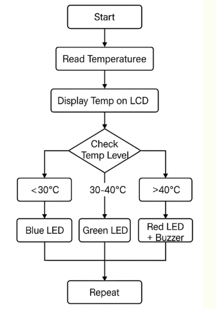
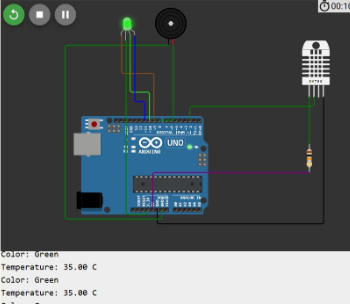
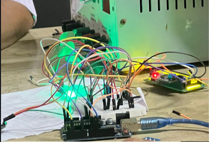
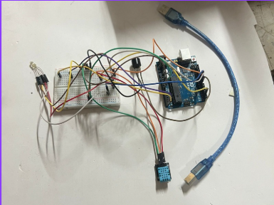

# 🔥 Smart RGB-Based Temperature Monitoring and Adaptive Cooling System

---

## 📌 Overview
This project presents a smart industrial safety system that monitors temperature in real-time and automatically controls cooling mechanisms. It uses RGB lighting for intuitive visual alerts and dynamically adjusts fan speed to prevent overheating, reduce downtime, and improve operational safety.

---

## 🖼️ Project Visuals

### 🔷 System Design & Implementation

**Description:**  
The images collectively illustrate the complete design and implementation of the system. The block diagram shows the overall architecture where the temperature sensor feeds data to the Arduino, which controls the RGB LED, cooling fan via motor driver, and buzzer. The circuit diagram details all electrical connections and interfacing. The hardware images demonstrate the real-world prototype, from initial setup to the fully integrated working system.

---

## 🚀 Features

### 🌡️ Real-Time Temperature Monitoring
- Uses DHT11/LM35 sensor to continuously track temperature

### 🌈 RGB Visual Indication
- 🔵 Blue → Normal (< 35°C)  
- 🟢 Green → Warning (= 35°C)  
- 🔴 Red → Critical (> 35°C)

### 🌀 Adaptive Fan Speed Control
- PWM-based control  
- 20°C → Fan OFF  
- 40°C → Full Speed  

### 🔔 Buzzer Alert System
- Activates when temperature exceeds safe threshold  

### 📟 Live Temperature Display
- Optional I2C LCD display for operators  

### ⚙️ Compact & Scalable Design
- Can be deployed across multiple machines  

---

## 🧰 Components Used

- Arduino UNO  
- Temperature Sensor (DHT11 / DHT22 / LM35)  
- RGB LED  
- L298N Motor Driver  
- Cooling Fan  
- Buzzer  
- Power Supply (5V / 12V)  
- Breadboard & Jumper Wires  
- Resistors (220Ω)  

---

## 🧠 Working Principle

1. Temperature is continuously sensed using DHT11  
2. Arduino processes the data  
3. RGB LED indicates temperature level  
4. Fan speed is adjusted using PWM  
5. Buzzer alerts during critical conditions  

---

## 🛠️ Implementation Steps

1. Define system objectives  
2. Collect required components  
3. Setup hardware and circuit connections  
4. Develop Arduino code  
5. Test and debug system  
6. Final optimization  

---

## 🔮 Future Scope

- 🤖 AI-based predictive temperature control  
- 👕 Wearable RGB temperature indicators  
- 🏥 Smart healthcare monitoring systems  
- 🏭 Advanced industrial safety automation  

---

## 🎯 Applications

- Industrial machines  
- Smart manufacturing systems  
- Electronics cooling systems  
- Smart homes & automation  

---

## 📚 References

- Smart Lighting Systems for Smart Cities  
- IoT-Based Energy Efficiency Systems  
- Cyber-Physical Smart Grid Integration  
- Industrial IoT Applications (IEEE Papers)  

## ⚡ Key Takeaway

This project enhances **industrial safety and efficiency** by combining IoT-based sensing, automation, and visual feedback into a smart cooling system.
